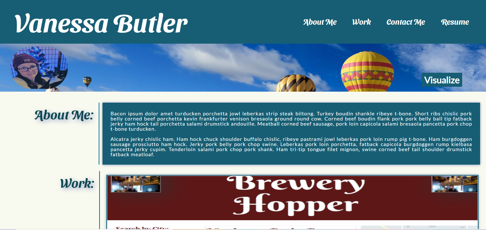

# updatedPortfolio
An updated portfolio page that has a more attractive design and includes all elements that were missing in the portfolio submitted in week 2, including a picture, working flexbox elements, and project name with technologies used on the project images. 

## Table of Contents

1. Installation
2. Usage
3. Images
4. Credits
5. License
6. URL

## Installation

Clone with SSH Key:
git@github.com:cwf1984/updatedPortfolio.git

Or use the URL listed below to view the live webpage.

## Usage

* The navigation links in the header direct the user to the correct section: About Me, Work (with live links), and contact information on the bottom of the page. Resume takes users to a PDF of my latest resume that was updated in November 2020 but still needs tailored for potential web development jobs.
* Four of the five images in the work section take the user to a live link showcasing the work done. 
* In the Contact Me section at the bottom of the page, users can click on Github and LinkedIn to be directed to my profile pages. Email allows users to reach me by email.

## Images

Below is an image of the finished project:

## Credits

Thank you to Bootcamp Spot, the University of Washington and Trilogy Education for the guidelines given to create this project. It provided a great deal of practice and also showed me what I need to keep working on.

## License

MIT License

Copyright (c) [2020] [Vanessa B]

Permission is hereby granted, free of charge, to any person obtaining a copy
of this software and associated documentation files (the "Software"), to deal
in the Software without restriction, including without limitation the rights
to use, copy, modify, merge, publish, distribute, sublicense, and/or sell
copies of the Software, and to permit persons to whom the Software is
furnished to do so, subject to the following conditions:

The above copyright notice and this permission notice shall be included in all
copies or substantial portions of the Software.

THE SOFTWARE IS PROVIDED "AS IS", WITHOUT WARRANTY OF ANY KIND, EXPRESS OR
IMPLIED, INCLUDING BUT NOT LIMITED TO THE WARRANTIES OF MERCHANTABILITY,
FITNESS FOR A PARTICULAR PURPOSE AND NONINFRINGEMENT. IN NO EVENT SHALL THE
AUTHORS OR COPYRIGHT HOLDERS BE LIABLE FOR ANY CLAIM, DAMAGES OR OTHER
LIABILITY, WHETHER IN AN ACTION OF CONTRACT, TORT OR OTHERWISE, ARISING FROM,
OUT OF OR IN CONNECTION WITH THE SOFTWARE OR THE USE OR OTHER DEALINGS IN THE
SOFTWARE.

## URL
https://cwf1984.github.io/updatedPortfolio/